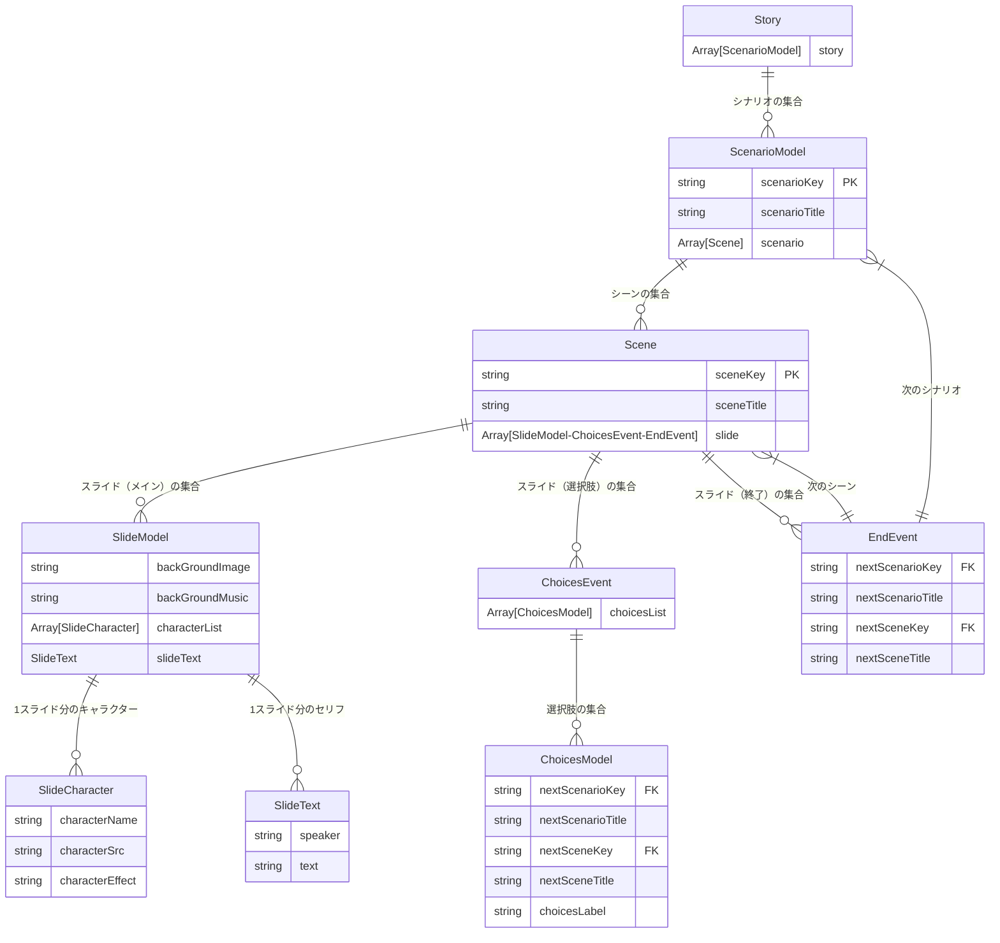

```mermaid
erDiagram

Story ||--o{ ScenarioModel: "シナリオの集合"
ScenarioModel ||--o{ Scene: "シーンの集合"
Scene ||--o{ SlideModel: "スライド（メイン）の集合"
Scene ||--o{ ChoicesEvent: "スライド（選択肢）の集合"
Scene ||--o{ EndEvent: "スライド（終了）の集合"
SlideModel ||--o{ SlideCharacter: "1スライド分のキャラクター"
SlideModel ||--o{ SlideText: "1スライド分のセリフ"
ChoicesEvent ||--o{ ChoicesModel: "選択肢の集合"
EndEvent ||--|{ ScenarioModel: "次のシナリオ"
EndEvent ||--|{ Scene: "次のシーン"

Story {
    Array[ScenarioModel] story
}

ScenarioModel {
    string scenarioKey PK
    string scenarioTitle
    Array[Scene] scenario
}

Scene {
    string sceneKey PK
    string sceneTitle
    Array[SlideModel-ChoicesEvent-EndEvent] slide
}

SlideModel {
    string backGroundImage
    string backGroundMusic
    Array[SlideCharacter] characterList
    SlideText slideText
}

SlideCharacter {
    string characterName
    string characterSrc
    string characterEffect
}

SlideText {
    string speaker
    string text
}

ChoicesEvent {
    Array[ChoicesModel] choicesList
}

ChoicesModel {
    string nextScenarioKey FK
    string nextScenarioTitle
    string nextSceneKey FK
    string nextSceneTitle
    string choicesLabel
}

EndEvent {
    string nextScenarioKey FK
    string nextScenarioTitle
    string nextSceneKey FK
    string nextSceneTitle
}


```